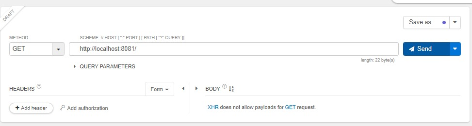
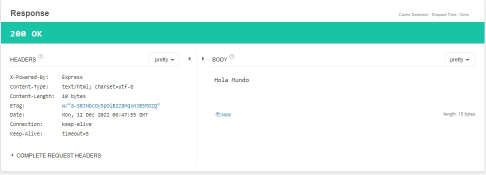
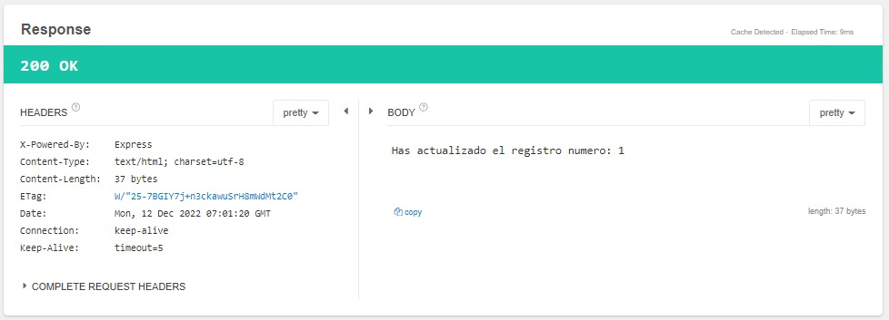
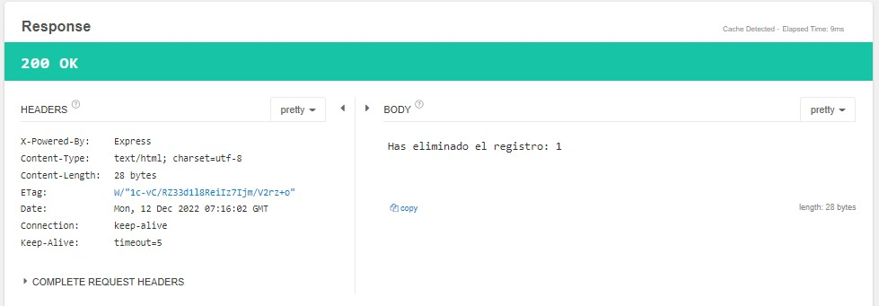

### Creamos nuestro proyecto
    npm init

### Instalamos express
    npm install express

### Instalamos body-parser: Nos permite agarrar bien los resultados de las peticiones de express
    npm install body-parser

### Instalamos cookie-parser
    npm install cookie-parser

### Intalamos multer: middleware
    npm install multer

### Ejecutamos index.js
    node index.js

http://localhost:8081/

## GET
##### DRAFT

##### RESPONSE

## POST
##### DRAFT

##### RESPONSE

## PUT
##### DRAFT

##### RESPONSE

## DELETE
##### DRAFT

##### RESPONSE

http://localhost:8081/users?user=1

### NODEMOM 🠮 https://www.npmjs.com/package/nodemon
