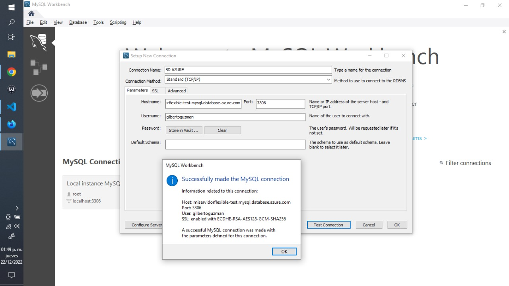

Servidores de Azure Database for MySQL

### Creamos el proyecto y le decimos a todo que si...    
    npm init --y

### Instalamos eslint
    npm install eslint --save-dev

### Configuramos eslint, luego escribimos y(yes)
    npm init @eslint/config
### Despues seleccionamos estas opciones:
- To check syntax and find problems
- JavaScript modules (import/export)
- None of these
- No
- Browser
- JavaScript

### Identificar errores
    npx eslint ./

### Darle formato al codigo
shift + alt + f

### Instalamos jsdoc, con esto documentamos el codigo
    npm install --save-dev jsdoc

### Para documentar el codigo tambien podemos usar 🠮 https://chat.openai.com/chat

### Conexion MySQL con Azure

### SQL 🠮 Structured Query Language 🠮 Nos permite consultar y obtener datos

### https://octoverse.github.com/2022/top-programming-languages

