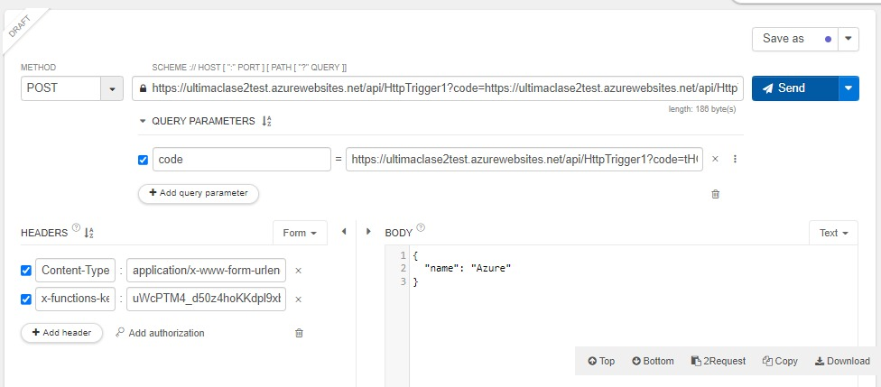

### Clonamos este repositorio en nuestro vscode
    git clone https://github.com/Azure-Samples/azure-voting-app-redis.git

### Ejecutamos el coando compose
    docker-compose

Usage:  docker compose [OPTIONS] COMMAND

Docker Compose

Options:
      --ansi string                Control when to print ANSI control        
                                   characters ("never"|"always"|"auto")      
                                   (default "auto")
      --compatibility              Run compose in backward compatibility mode
      --env-file string            Specify an alternate environment file.
  -f, --file stringArray           Compose configuration files
      --profile stringArray        Specify a profile to enable
      --project-directory string   Specify an alternate working directory
                                   (default: the path of the, first
                                   specified, Compose file)
  -p, --project-name string        Project name

Commands:
  build       Build or rebuild services
  convert     Converts the compose file to platform's canonical format
  cp          Copy files/folders between a service container and the local filesystem
  create      Creates containers for a service.
  down        Stop and remove containers, networks
  events      Receive real time events from containers.
  exec        Execute a command in a running container.
  images      List images used by the created containers
  kill        Force stop service containers.
  logs        View output from containers
  ls          List running compose projects
  pause       Pause services
  port        Print the public port for a port binding.
  ps          List containers
  pull        Pull service images
  push        Push service images
  restart     Restart service containers
  rm          Removes stopped service containers
  run         Run a one-off command on a service.
  start       Start services
  stop        Stop services
  top         Display the running processes
  unpause     Unpause services
  up          Create and start containers
  version     Show the Docker Compose version information

Run 'docker compose COMMAND --help' for more information on a command.

### Creamos una imagen de docker
    docker-compose up -d

### Checamos las imagenes de docker
    docker images

### Comandos Mac Os
    docker-compose -f docker-compose.yml --platform linux/x86_64
    docker run --platform linux/x86_64 azure-vote-front

### Checar los contenedores en ejecucion
    docker ps

### Cerramos los contenedores en ejecucion
    docker-compose-down

# CLI AZURE
### Instalamos el CLI: https://learn.microsoft.com/en-us/cli/azure/install-azure-cli

### Para testear nuestra funcion rellenamos los siguientes datos: 

### Actualizacion codigo index.js
    module.exports = async function (context, req) {
        context.log('JavaScript HTTP trigger function processed a request.');

        let responseMessage = "";

        try {
            if(req.body.name) {
            responseMessage = `Hola ${req.body.name} Bienvenido`
            }
            else {
                responseMessage = "Pon tu nombre, no seas miserable";
            }
        } catch (error) {
            responseMessage = "Pon tu nombre, no seas miserable";
        }

        context.res = {
            // status: 200, /* Defaults to 200 */
            body: responseMessage
        };
    }

### Con anonymous, eliminamos la necesidad de utilizar una clave como requisito:
    {
    "bindings": [
        {
        "authLevel": "anonymous",
        "type": "httpTrigger",
        "direction": "in",
        "name": "req",
        "methods": [
            "get",
            "post"
        ]
        },
        {
        "type": "http",
        "direction": "out",
        "name": "res"
        }
    ]

### Informacion Azure CLI
    az

### Login Azure CLI
    az login

### Documentación Azure CLI: https://learn.microsoft.com/es-mx/cli/azure/

### Creamos un registro de contenedor: Nota, al tener errores con este comando se decidio proseguir en la GUI de Azure
    az acr --resource-group ultimaclase --name miappdocker --sku basic

### Creamos nuestro acrLoginServer
    az acr list --resource-group ultimaclasetest --query "[].{acrLoginServer:loginServer}" --output table

### acrLoginServer
    miultimaclasetest.azurecr.io

### docker/getting-started
    docker run -d -p 80:80 docker/getting-started

### Generamos un docker tag para subirlo
    docker tag docker/getting-started:latest miultimaclasetest.azurecr.io/dockerguide:v1

### Esta imagen la subimos a azure: miultimaclasetest.azurecr.io/dockerguide

### Nos logeamos...
    az acr login --name miultimaclasetest.azurecr.io/dockerguide:v1
    az acr login --name miultimaclasetest

### Y hacemos push...
    docker push miultimaclasetest.azurecr.io/dockerguide:v1

    az aks create \
        --resource-group ultimaclasetest \
        --name myakastest \
        --node-count 2 \
        --generate-ssh-keys \
        --attach-acr miultimaclasetest

### Instalamos 
    az aks install-cli

### Manejo de contenedores
    kubectl